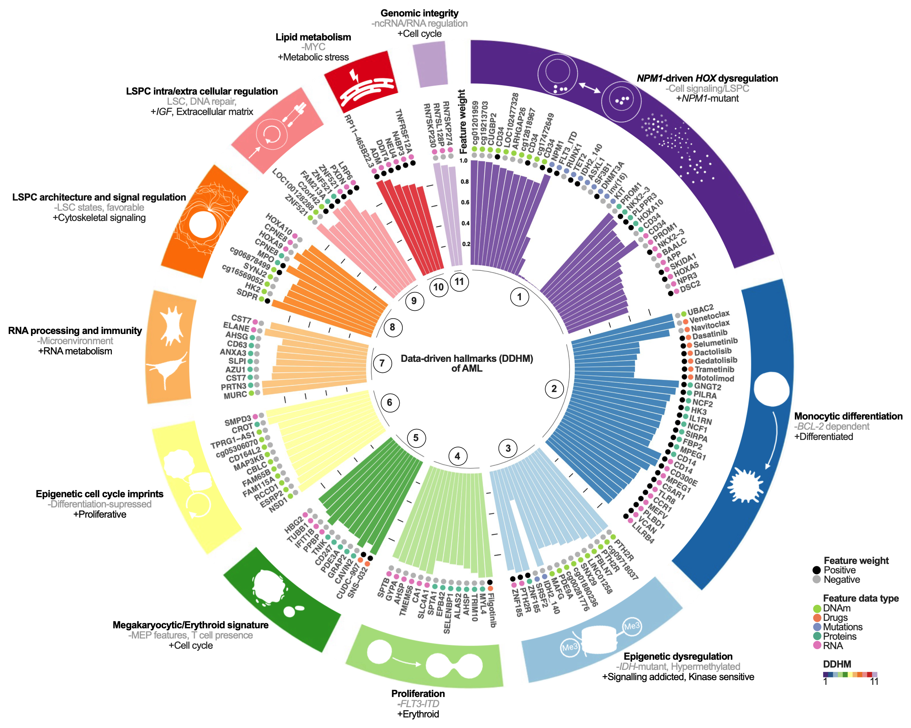

# MOFA_AML

Code for the paper : Data-driven hallmarks reveal actionable disease programs and predict drug sensitivity in acute myeloid leukemia

## About

In this study, we introduce the Data-Driven Hallmark (DDHM), a low dimensional representation concept for facilitating multi-omics interpretation in translational cancer research, using acute myeloid leukemia (AML) as a model. MOFA was used for integration of multi-omics data (genomics, methylation, transcriptomics, proteomics) and ex vivo drug response profiles from 118 AML patients at diagnosis, revealing complex disease related mechanisms of AML.

## Installation

## Clone repository
```
git clone https://github.com/FloraMika/MOFA_AML.git
cd MOFA_AML
```

## Requirements

1. A linux distribution.
2. Install the required **R packages** :

```
Rscript source/requierements.R
# This command will install the packages necessary for the analysis 
```

## AML MOFA model

MOFA model can be accessed using the following code. For the installation and use of MOFA2, we recommend looking at the authors website https://biofam.github.io/MOFA2/tutorials.html.

Analyses can be reproduced using the different R codes available in the src folder.



NB: MOFA model and CITE-seq analyses were performed on the vale server https://vale.scilifelab.se/ using R v3.6.0, MOFA2 v0.99.7, Seurat v3.2.2 to keep the original analysis.
All downstream analyses were done using R v4.4.2.

Model details are available online at https://leukemia.scilifelab.se


## Pipeline

```
Rscript /home/flomik/Code/MOFA_AML/src/Run_pipeline.R
# This command will run the whole pipeline 
```


## Authors
- [Flora Mikaeloff](https://github.com/FloraMika)
- Tojo James
- Francesco Marabita

## Acknowledgment

## License

This project is licensed under the Apache License.